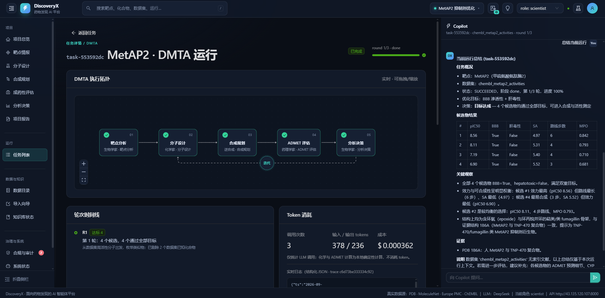
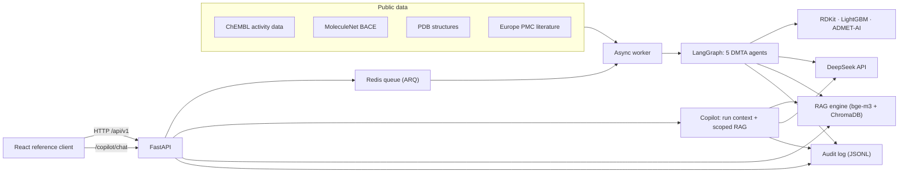

# DiscoveryX

> An open, enterprise-grade platform for AI-driven drug discovery — agentic
> **DMTA** workflows, literature-grounded **RAG**, enforced **guardrails**
> (RBAC / DLP / audit) and reproducible evaluation, exposed API-first.

[中文说明](README.zh-CN.md)

DiscoveryX is a **scientific agent platform**. It turns foundation models,
agents, retrieval and MLOps into capabilities a discovery team can actually
adopt, trust and reuse — and it proves them end-to-end on real public data.



*Task detail for a MetAP2 DMTA run: the multi-agent execution topology (five
specialist agents plus the analyse → design feedback loop), the round timeline,
token cost, and the **Copilot** assistant on the right.*

## Highlights

| Area | What it does |
|---|---|
| **Multi-agent orchestration** | LangGraph coordinates five specialist agents — **biologist → chemist → retrosynthesis → pharmacologist → analyze** — and loops them until the project's objectives are met or the round budget is spent. Every hop is emitted as a live, structured event. |
| **Deterministic core, LLM where it helps** | Pass/fail decisions, ADMET, QSAR, retrosynthesis and scoring are deterministic local compute. The model is used for three things only: the **target intelligence summary**, the **per-round decision narrative**, and the **design rationale** for the top candidate. No number in the platform is generated by an LLM. |
| **Copilot** | A guardrailed research assistant in the client. It grounds answers in the **current run's live state** (target, dataset, objectives, candidates, decision) plus **dataset-scoped** literature, cites sources inline, and every call is RBAC-checked, DLP-scanned and metered. |
| **Feedback-driven design** | When an objective is missed, the platform identifies *why* (e.g. too many hydrogen-bond donors) and applies targeted reactions next round instead of retrying blindly. |
| **Dataset-specific QSAR** | LightGBM model trained on the chosen dataset with a **scaffold split**, so the reported metrics are honest. No generic activity model is applied to a target it was not trained on. |
| **ADMET** | Pretrained Chemprop models (ADMET-AI) for DILI, hERG, BBB, solubility and more — zero training, CPU-capable. |
| **RAG** | Literature → bge-m3 embeddings → ChromaDB → clearance-filtered retrieval with citations. |
| **Guardrails** | RBAC permissions + data clearance, DLP that blocks/masks sensitive content before it leaves the boundary, append-only JSON-Lines audit log, human approval gates. |
| **Objective-aware reporting** | Reports and tables show pass/fail only for the endpoints a project actually optimises. An HTML/PDF report ships the decision, target intelligence, candidates with RDKit structures, a predicted-vs-measured validation plot, evidence and a run manifest. |
| **Cost transparency** | Every LLM call is metered from the provider's own usage numbers and priced per model. Usage is consolidated on the project overview and per-run on the task detail page. |
| **Async tasks** | Redis-backed, asyncio-native queue. Submit a task, poll its state; the API never blocks on chemistry. |
| **API-first** | FastAPI with a complete OpenAPI schema; a React + TypeScript reference client consumes it over HTTP. |

## Architecture



```
backend/            FastAPI app, core engine, async tasks, tests
  app/api/v1/       REST routers (health, tasks, projects, datasets, rag,
                    guardrails, approvals, copilot)
  app/core/         agent_graph, qsar, admet, compounds, rag_engine,
                    guardrails, dlp, rbac, audit, report, copilot
  app/tasks/        queue, worker, workflow
  config/           settings.py, rbac_policy.json
  eval/             bio_bench.py — standalone RDKit/ADMET scoring
frontend/           React + TypeScript + Vite reference client (i18n: zh/en)
data/               download_data.py — builds every dataset from public sources
docs/               demo-script.md, security.md
scripts/            deploy.sh, bootstrap-ubuntu.sh, vm_sync.py / vm_ssh.py
docker-compose.yml  redis + api + worker + frontend
```

## Quick start

### One-command deploy (Linux host)

```bash
cp .env.example .env             # optional: scripts/deploy.sh creates it for you
$EDITOR .env                     # set DEEPSEEK_API_KEY

scripts/deploy.sh
```

`scripts/deploy.sh` is idempotent and does the whole environment in one pass:
preflight checks → `.env` → backend venv + dependencies → datasets from public
sources → frontend build → Redis → API + worker (systemd when available, nohup
otherwise) → health check.

```bash
scripts/deploy.sh --check          # preflight only, change nothing
scripts/deploy.sh --skip-data      # reuse datasets already on disk
scripts/deploy.sh --skip-frontend  # backend only
```

On a bare Ubuntu machine, `scripts/bootstrap-ubuntu.sh` installs the host
prerequisites first (build tools, uv + Python 3.11, Docker, Node 20, CJK fonts).

### Keeping a remote host in sync

`scripts/vm_sync.py` mirrors this repo to a remote host over SFTP and skips
unchanged files. Runtime state (datasets, models, vector store, audit log,
projects/approvals, logs, builds, `.env`) is never touched.

```bash
export DX_VM_HOST=<host> DX_VM_USER=<user> DX_VM_KEY=~/.ssh/<key>
python scripts/vm_sync.py                  # upload changed files
python scripts/vm_sync.py --prune-dry-run  # list files that no longer exist locally
python scripts/vm_sync.py --prune          # upload + delete stale files
python scripts/vm_ssh.py --script scripts/remote/final_check.sh
```

### Docker Compose

```bash
cp .env.example .env
$EDITOR .env                     # set DEEPSEEK_API_KEY

docker compose up --build

# build the datasets (real public sources, one-off)
docker compose exec api python data/download_data.py --index
```

* Reference client: <http://localhost:8080>
* API docs: <http://localhost:8000/docs>

### Local development

```bash
make setup      # backend venv + frontend dependencies
make data       # datasets from public sources (+ RAG index)
make dev-api    # uvicorn --reload on :8000
make worker     # ARQ worker
make dev-web    # Vite dev server
make test       # ruff + pytest + frontend build
```

`make help` lists every target.

## Data

`data/download_data.py` builds every dataset from a **public source** — nothing
is mocked or hand-written. Each sub-directory of `data/datasets/` is one dataset
and declares its metadata in `dataset.json`.

| Dataset | Source | Type |
|---|---|---|
| `chembl_casp3_activities` | ChEMBL (CHEMBL2334) | tabular |
| `chembl_metap2_activities` | ChEMBL (CHEMBL3922) | tabular |
| `chembl_egfr_activities` | ChEMBL (CHEMBL203) | tabular |
| `chembl_ache_activities` | ChEMBL (CHEMBL220) | tabular |
| `molecule_net_bace` | MoleculeNet | tabular |
| `pdb_bace1_structures` | RCSB PDB | structure |
| `pmc_bace1_literature` | Europe PMC | document |

ChEMBL exports are cleaned before use: only uncensored (`=`) IC50 values in nM
are kept, and each molecule is collapsed to the **median** pIC50 across its
assays — one unambiguous label per molecule. Raw exports contain the same
compound assayed many times with spreads of several log units, which is not
directly trainable.

A dataset can drive a DMTA run only if it has a SMILES column **and** a
continuous activity column (`pIC50` / `IC50`). Anything else is rejected with
`422` and a clear reason.

```bash
python data/download_data.py                       # build all datasets
python data/download_data.py --only chembl_casp3_activities
python data/download_data.py --index               # also build the RAG index
```

Datasets are managed from the client (upload, index, **delete**) and over the
API. Deleting a dataset removes its directory, its RAG collection and its index
state in one step, and requires the `dataset:delete` permission (engineer /
admin) plus sufficient clearance for the dataset's sensitivity.

## Security model

Enforced in the core engine, not in the UI. Denials raise `GuardrailViolation`
and abort the workflow; every decision is appended to the audit log.

* **RBAC** — `backend/config/rbac_policy.json` maps roles to permissions and to
  a data **clearance** (`public < internal < confidential < restricted`).
  Dataset reads and RAG retrieval are filtered by clearance.
* **DLP** — sensitive patterns (internal project ids, PII, protein sequences)
  are scanned **before any external LLM call**; `BLOCK` rules abort, `MASK`
  rules redact in place.
* **Approvals** — workflow output never advances on its own; a human decision is
  required and recorded.
* **Audit** — every allow/deny decision is written to `data/audit/audit.jsonl`
  as JSON Lines with a `trace_id`.

See [docs/security.md](docs/security.md) for the full model.

## Copilot

The Copilot is the assistant embedded in the reference client (the right-hand
panel in the screenshot above). It is not a generic chatbot bolted onto the UI —
it answers **about the run you are looking at**:

* **Run-grounded** — the context it receives is the live task state: target,
  dataset, objectives, per-round summaries, top candidates with their predicted
  pIC50 / ADMET / SA / route / MPO, the decision, and the PDB evidence.
* **Dataset-scoped literature** — retrieval is restricted to the collection that
  belongs to the run's dataset. A MetAP2 run is never justified with BACE1
  papers; if the dataset has no indexed literature, the Copilot says so instead
  of pulling unrelated sources.
* **Guardrailed** — every call is RBAC-checked (`copilot:chat`) and DLP-scanned
  before it leaves the boundary, and the decision is written to the audit log.
* **Metered** — token usage and cost are accounted per call, like every other
  LLM path in the platform.
* **Cited** — literature sources are returned as citations and shown inline.

```bash
curl -s -X POST http://localhost:8000/api/v1/copilot/chat \
  -H 'Content-Type: application/json' -H 'X-Role: scientist' \
  -d '{"message":"summarise the current run","task_id":"task-…"}'
```

## Where the model is used

Everything that can be computed is computed, not generated. The LLM is invoked
in exactly four places:

| Call | Where | What it produces |
|---|---|---|
| `target_summary` | biologist agent | Target intelligence prose grounded in the PDB entry and the retrieved sources |
| `design_rationale` | chemist agent | One-sentence rationale for the top candidate |
| `decision_narrative` | analyze agent | Per-round narrative for the discovery team (numbers are passed in, never invented) |
| `rag` | RAG engine | Answer synthesis over retrieved sources (used by the biologist, the RAG page and the Copilot) |

Pass/fail decisions, QSAR predictions, ADMET endpoints, retrosynthesis and MPO
scoring are **deterministic local compute**. Token usage is read from the
provider's own response and priced per model
(`backend/app/core/llm_factory.py`), so the numbers on the overview and the task
detail page are measured, not estimated.

## Demo

A reproducible 15–20 minute walkthrough (two targets, objectives met end to
end, plus governance and guardrail demos) lives in
[docs/demo-script.md](docs/demo-script.md):

```bash
python scripts/vm_ssh.py --timeout 1500 --script scripts/remote/demo_run.sh
```

## Testing

```bash
cd backend
ruff check .
pytest -q          # 72 tests: API, RBAC, DLP, guardrails, chemistry tools
cd ../frontend && npm run build
```

CI runs the same three gates on every push — see
[.github/workflows/ci.yml](.github/workflows/ci.yml).

## Contributing

See [CONTRIBUTING.md](CONTRIBUTING.md). Contributions of all kinds are welcome.

## License

Apache-2.0 — see [LICENSE](LICENSE).
