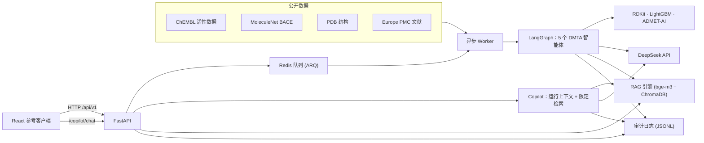

# DiscoveryX

> 一个开源、面向企业级场景的 AI 药物发现平台 —— 智能体驱动的 **DMTA** 工作流、
> 基于文献的 **RAG**、真实生效的**安全护栏**（RBAC / DLP / 审计）以及可复现的评估，
> 以 API-First 方式对外提供。

[English](README.md)

DiscoveryX 是一个**科研智能体平台**：把基础模型、智能体、检索与 MLOps 变成研发团队
真正能采纳、信任并复用的能力，并用真实公开数据端到端地验证它们。


*一次 MetAP2 DMTA 运行的任务详情页：多智能体执行拓扑（五个专职智能体 +
分析决策 → 分子设计的反馈回环）、轮次时间线、Token 消耗，以及右侧的
**Copilot** 智能助手。*

## 核心能力

| 模块 | 说明 |
|---|---|
| **多智能体编排** | LangGraph 编排五个专职智能体 —— **生物学家 → 化学家 → 逆合成 → 药理学家 → 分析决策** —— 并循环执行，直至项目目标达成或轮次用尽。每一次流转都会以结构化事件实时上报。 |
| **确定性内核，LLM 只做该做的** | 达标判定、ADMET、QSAR、逆合成与打分全部是本地确定性计算。模型只用于三件事：**靶点情报摘要**、**每轮决策叙述**、**Top 候选的设计理由**。平台中没有任何数值由 LLM 生成。 |
| **Copilot 智能助手** | 客户端内置的受护栏约束的研究助手。回答同时基于**当前运行的实时状态**（靶点、数据集、目标、候选、决策）与**按数据集限定**的文献检索，行内标注引用；每次调用都经过 RBAC 校验、DLP 扫描并计量。 |
| **反馈驱动设计** | 目标未达成时，平台先判断**失败原因**（例如氢键供体过多），下一轮施加针对性反应，而非盲目重试。 |
| **数据集专属 QSAR** | 用所选数据集现场训练 LightGBM，采用 **scaffold 划分**，因此报告的指标是诚实的；不会把泛化模型套用到它没训练过的靶点上。 |
| **ADMET** | ADMET-AI 预训练 Chemprop 模型（DILI、hERG、BBB、溶解度等），零训练、CPU 可跑。 |
| **RAG** | 文献 → bge-m3 向量化 → ChromaDB → 按数据分级过滤的带引用检索。 |
| **安全护栏** | RBAC 权限 + 数据分级；DLP 在内容离开边界前拦截/脱敏；append-only JSON-Lines 审计日志；人工审批闸门。 |
| **目标感知报告** | 报告与表格只对项目真正优化的端点显示达标与否。HTML/PDF 报告包含决策、靶点情报、RDKit 结构式候选、预测 vs 实测验证散点图、证据与运行清单。 |
| **成本透明** | 每次 LLM 调用都按模型单价、以服务商返回的真实用量计量。用量汇总在项目总览，单次运行明细在任务详情页。 |
| **异步任务** | 基于 Redis 的 asyncio 原生队列。提交任务后轮询状态，API 不会被化学计算阻塞。 |
| **API-First** | FastAPI 提供完整 OpenAPI；React + TypeScript 参考客户端通过 HTTP 调用。 |

## 架构



```
backend/            FastAPI 应用、核心引擎、异步任务、测试
  app/api/v1/       REST 路由（health, tasks, projects, datasets, rag,
                    guardrails, approvals, copilot）
  app/core/         agent_graph, qsar, admet, compounds, rag_engine,
                    guardrails, dlp, rbac, audit, report, copilot
  app/tasks/        queue, worker, workflow
  config/           settings.py, rbac_policy.json
  eval/             bio_bench.py —— 可独立运行的 RDKit/ADMET 打分
frontend/           React + TypeScript + Vite 参考客户端（中英双语）
data/               download_data.py —— 从公开数据源构建全部数据集
docs/               demo-script.md, security.md
scripts/            vm_ssh.py / vm_sync.py 工具 + 远程运维脚本
docker-compose.yml  redis + api + worker + frontend
```

## 快速开始

### 一键部署（Linux 主机）

```bash
cp .env.example .env             # 可选：scripts/deploy.sh 会自动创建
$EDITOR .env                     # 填写 DEEPSEEK_API_KEY

scripts/deploy.sh
```

`scripts/deploy.sh` 幂等可重复执行，一次完成整套环境准备：
预检 → `.env` → 后端 venv 与依赖 → 从公开数据源构建数据集 → 前端构建 →
Redis → API 与 Worker（有 systemd 用 systemd，否则 nohup）→ 健康检查。

```bash
scripts/deploy.sh --check          # 仅预检，不改动任何东西
scripts/deploy.sh --skip-data      # 复用已存在的数据集
scripts/deploy.sh --skip-frontend  # 只部署后端
```

在全新的 Ubuntu 机器上，先运行 `scripts/bootstrap-ubuntu.sh` 安装宿主依赖
（编译工具、uv + Python 3.11、Docker、Node 20、中日韩字体）。

### 与远程主机保持同步

`scripts/vm_sync.py` 通过 SFTP 把本仓库镜像到远程主机，并跳过未变更的文件。
运行时状态（数据集、模型、向量库、审计日志、项目/审批、日志、构建产物、`.env`）
永不触碰。

```bash
export DX_VM_HOST=<host> DX_VM_USER=<user> DX_VM_KEY=~/.ssh/<key>
python scripts/vm_sync.py                  # 上传有变更的文件
python scripts/vm_sync.py --prune-dry-run  # 列出本地已不存在的文件
python scripts/vm_sync.py --prune          # 上传并删除残留文件
python scripts/vm_ssh.py --script scripts/remote/final_check.sh
```

### Docker Compose

```bash
cp .env.example .env
$EDITOR .env                     # 填写 DEEPSEEK_API_KEY

docker compose up --build

# 构建数据集（真实公开数据源，一次性）
docker compose exec api python data/download_data.py --index
```

* 参考客户端：<http://localhost:8080>
* API 文档：<http://localhost:8000/docs>

### 本地开发

```bash
make setup      # 后端 venv + 前端依赖
make data       # 从公开数据源构建数据集（含 RAG 索引）
make dev-api    # uvicorn --reload，:8000
make worker     # ARQ Worker
make dev-web    # Vite 开发服务器
make test       # ruff + pytest + 前端构建
```

`make help` 可列出全部目标。

## 数据

`data/download_data.py` 从**公开数据源**构建全部数据集，没有任何模拟或手工编造的数据。
`data/datasets/` 下的每个子目录就是一个数据集，并在 `dataset.json` 中声明元数据。

| 数据集 | 来源 | 类型 |
|---|---|---|
| `chembl_casp3_activities` | ChEMBL (CHEMBL2334) | 表格 |
| `chembl_metap2_activities` | ChEMBL (CHEMBL3922) | 表格 |
| `chembl_egfr_activities` | ChEMBL (CHEMBL203) | 表格 |
| `chembl_ache_activities` | ChEMBL (CHEMBL220) | 表格 |
| `molecule_net_bace` | MoleculeNet | 表格 |
| `pdb_bace1_structures` | RCSB PDB | 结构 |
| `pmc_bace1_literature` | Europe PMC | 文档 |

ChEMBL 导出数据在使用前会做清洗：只保留未删失（`=`）的 nM 级 IC50，并把同一分子的
多次测定取**中位数**收敛为一个标签 —— 每个分子只有一个明确标签。原始导出中同一化合物
会被多次测定，且分歧可达数个 log 单位，无法直接用于训练。

只有同时具备 SMILES 列**和**连续活性列（`pIC50` / `IC50`）的数据集才能驱动 DMTA 运行；
其余会以 `422` 及明确原因被拒绝。

```bash
python data/download_data.py                       # 构建全部数据集
python data/download_data.py --only chembl_casp3_activities
python data/download_data.py --index               # 同时构建 RAG 索引
```

数据集可在客户端（上传、索引、**删除**）或通过 API 管理。删除会一次性移除数据目录、
对应的 RAG 集合与索引状态，需要 `dataset:delete` 权限（engineer / admin）且
分级达到该数据集的敏感级。

## 安全模型

在核心引擎中强制执行，而非依赖前端。拒绝会抛出 `GuardrailViolation` 并中断工作流；
每一次决策都会写入审计日志。

* **RBAC** —— `backend/config/rbac_policy.json` 把角色映射到权限与数据**分级**
  （`public < internal < confidential < restricted`）。数据集读取与 RAG 检索按分级过滤。
* **DLP** —— 敏感模式（内部项目编号、个人身份信息、蛋白序列）在**任何外部 LLM 调用之前**
  被扫描；`BLOCK` 规则中断流程，`MASK` 规则就地脱敏。
* **人工审批** —— 工作流产出不会自动推进，必须有人工决策并留痕。
* **审计** —— 每一次允许/拒绝都作为 JSON Lines 写入 `data/audit/audit.jsonl`，带 `trace_id`。

完整模型见 [docs/security.md](docs/security.md)。

## Copilot 智能助手

Copilot 是参考客户端内置的智能助手（上方截图右侧面板）。它不是外挂在界面上的通用
聊天机器人 —— 它回答的是**你正在看的这次运行**：

* **基于运行上下文** —— 它接收的是任务实时状态：靶点、数据集、目标属性、逐轮摘要、
  Top 候选的预测 pIC50 / ADMET / SA / 路线 / MPO、决策结论，以及 PDB 证据。
* **按数据集限定文献** —— 检索被限制在**该运行数据集所属的知识集合**内。MetAP2 的运行
  绝不会用 BACE1 的文献来佐证；若该数据集没有建立文献索引，Copilot 会明确说明，
  而不是去拉无关来源。
* **受护栏约束** —— 每次调用都做 RBAC 校验（`copilot:chat`）与 DLP 扫描，决策写入审计日志。
* **计量** —— 每次调用的 Token 用量与成本都计入账目，与平台其他 LLM 调用一致。
* **可溯源** —— 文献来源以引用形式返回并内联展示。

```bash
curl -s -X POST http://localhost:8000/api/v1/copilot/chat \
  -H 'Content-Type: application/json' -H 'X-Role: scientist' \
  -d '{"message":"总结当前运行","task_id":"task-…"}'
```

## 模型用在哪里

凡是能计算的一律计算，不靠生成。LLM 只在四处被调用：

| 调用 | 位置 | 产出 |
|---|---|---|
| `target_summary` | 生物学家智能体 | 基于 PDB 条目与检索来源生成的靶点情报摘要 |
| `design_rationale` | 化学家智能体 | Top 候选的一句话设计理由 |
| `decision_narrative` | 分析决策智能体 | 给研发团队的每轮叙述（数值由程序传入，模型不得编造） |
| `rag` | RAG 引擎 | 基于检索来源的答案合成（供生物学家、文献检索页与 Copilot 使用） |

达标判定、QSAR 预测、ADMET 端点、逆合成与 MPO 打分全部是**本地确定性计算**。
Token 用量取自服务商返回的真实数据并按模型单价计价
（`backend/app/core/llm_factory.py`），因此总览页与任务详情页上的数字是实测值，不是估算。

## 演示

一份可复现的 15–20 分钟走查（两个靶点、端到端达成目标，外加治理与护栏演示）见
[docs/demo-script.md](docs/demo-script.md)：

```bash
python scripts/vm_ssh.py --timeout 1500 --script scripts/remote/demo_run.sh
```

## 测试

```bash
cd backend
ruff check .
pytest -q          # 72 项测试：API、RBAC、DLP、护栏、化学工具
cd ../frontend && npm run build
```

CI 在每次 push 时运行同样的三道门禁 —— 见
[.github/workflows/ci.yml](.github/workflows/ci.yml)。

## 参与贡献

见 [CONTRIBUTING.md](CONTRIBUTING.md)。欢迎任何形式的贡献。

## 许可证

Apache-2.0 —— 见 [LICENSE](LICENSE)。
